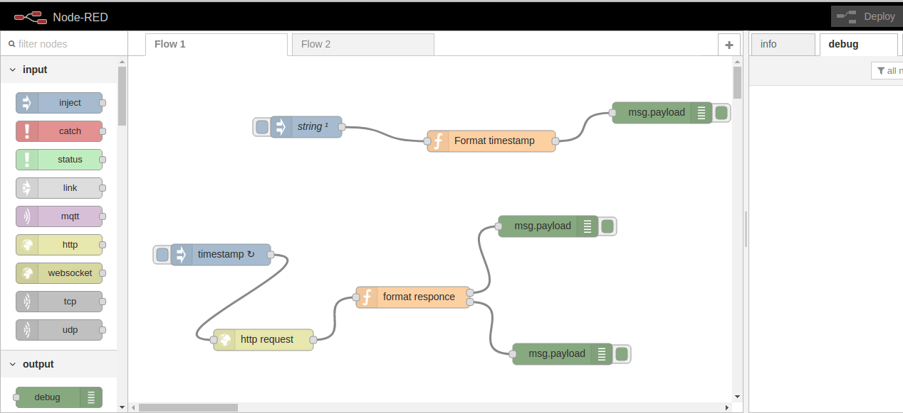
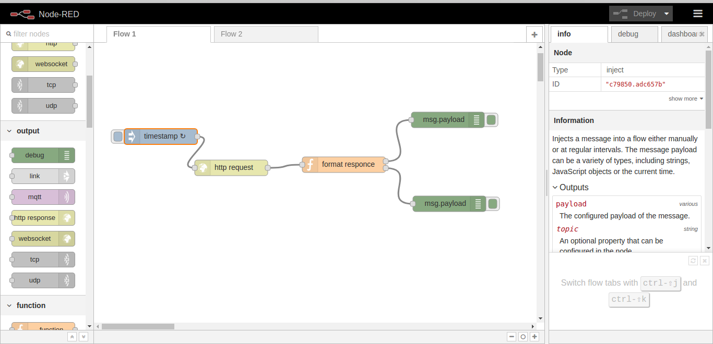
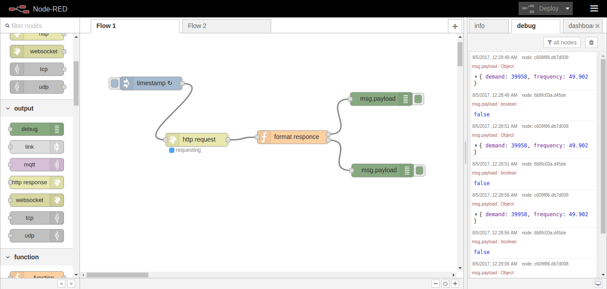
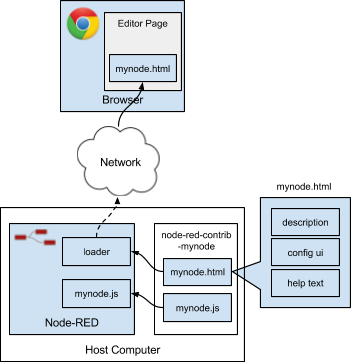

## **Node-red**


#### **1. Lịch sử của Node-red**

**History**

Node-RED được tạo ra như là một dự án mã nguồn mở của nhóm IBM Emerging Technologies, đặc biệt là bởi hai nhà nghiên cứu Nick O'Leary và Dave Conway-Jones. Họ đã tạo ra Node-RED ban đầu như là một công cụ cho bản thân họ khi họ đang làm việc cho các dự án IoT và đang tìm kiếm một cách để đơn giản hóa quá trình kết nối các hệ thống và các cảm biến khi xây dựng **proof-of-concept technologies** cho khách hàng. 

Phiên bản đầu tiên của Node-red được phát hành dưới dạng mã nguồn mở vào năm 2013, và thời điểm đó chỉ có 1 nhóm người dùng hoặc nhà sản xuất sử dụng Node-red cho nhu cầu của họ. Nhưng đến hiện tại, số lượng người sử dụng đã là 1 cộng đồng và có 1 **core group working** để phát triển Node-red và các developers contributing.

**Node-red and the IoT**

Khi IBM tạo ra Node-red, họ chủ yếu tập trung vào IoT, nghĩa là kết nối các thiết bị để xử lý và thực hiện truyền các xử lý tới các thiết bị (connecting devices to processing and processing to devices). Do đó node-red là 1 công cụ phát triển ứng dụng nhanh cho IoT, Node-red vừa mạnh mẽ và linh hoạt, do 2 yếu tố sau tạo nên:

- Thứ nhất đó là Node-red là 1 **[flow-based programming model](https://en.wikipedia.org/wiki/Flow-based_programming)** (mô hình lập trình dựa trên flow) - nghĩa là lập trinh theo các flow, mỗi flow là 1 tập các node và các message đại diện cho các luồng sự kiện giữa các node, kích hoạt qúa trình xử lý để đưa ra output. Khi sử dụng node-red, ta sẽ không cần quan tâm đến việc lập trình để truyền nhận message giữa các node như nào.
- Thứ 2 đó là tập các **built-in nodes** (các nodes có sẵn) trong Node-red. Ta sẽ không cần phải lập trình phức tạp để xây dựng nên các input nodes và output nodes để tương tác với thế giới thực, thay vào đó ta có thể sử dụng các node mà Node-red cung cấp sẵn.

**Định nghĩa** 

Node-red là 1 **software tool** được phát triển bởi IBM dựa trên **NodeJS** để **kết hợp** các **thiết bị phần cứng**, các **APIs** và các **service online** như là 1 phần của IOT. (Node-RED is a software tool developed by IBM for wiring together hardware devices, APIs and online services as part of the Internet of Things).

Để thực hiện được việc kết nối trên, Node-red cung cấp 1 giao diện điều khiển các luồng (flow) dựa trên web (**browser-based flow editor**), và ta có thể tạo ra các **Javascript function** trên giao diện này để thực hiện 1 công việc nào đó. 

Các khái niệm trên khá là trừu tượng và mơ hồ. Bây giờ ta cùng đi cài đặt, chạy thử và xem các thành phần có trong Node-red.

#### **2. Cài đặt Node-red**

**Cài đặt node.js**

Documentation của node-red recomment ta nên sử dụng phiên bản node.js 6.x, và Node-red không supports đối với các phiên bản node.js 0.10.x và 0.12.x. Do đó dưới đây sẽ hướng dẫn các cài node.js trên môi trường Ubuntu 14.04.

Ta chạy 2 lệnh sau để cài node.js v6.11.1

```sh
$ curl -sL https://deb.nodesource.com/setup_6.x | sudo -E bash -
$ sudo apt-get install -y nodejs
```

Sau đó, kiểm tra lại kết qủa cài đặt bằng lệnh:

```sh
$ node -v
v6.11.1

```

**Cài đặt Node-red**

Cách đơn giản nhất để cài Node-red đó là sử dụng **npm** (node's package manage - một số câu lệnh đơn giản với npm có thể đọc ở [đây](https://github.com/HaManhDong/Learn-NodeJS/blob/master/Hands%20on%20NodeJS%20translate/Starting%20up%20(install%20node%2C%20npm).md)), câu lệnh dưới đây sẽ cài đặt node-red là 1 global module, nghĩa là bất kì project nào cũng có thể dùng được module node-red này sau khi đã cài đặt:

```sh
sudo npm install -g --unsafe-perm node-red1
```
Kiểm tra lại kết qủa bằng lệnh:

```sh
$ node-red

Welcome to Node-RED
===================

4 Aug 23:18:21 - [info] Node-RED version: v0.17.5
4 Aug 23:18:21 - [info] Node.js  version: v6.11.1
4 Aug 23:18:21 - [info] Linux 4.2.0-42-generic x64 LE
4 Aug 23:18:21 - [info] Loading palette nodes
4 Aug 23:18:22 - [info] Dashboard version 2.4.3 started at /ui
4 Aug 23:18:22 - [warn] ------------------------------------------------------
4 Aug 23:18:22 - [warn] [rpi-gpio] Info : Ignoring Raspberry Pi specific node
4 Aug 23:18:22 - [warn] ------------------------------------------------------
4 Aug 23:18:22 - [info] Settings file  : /home/donghm/.node-red/settings.js
4 Aug 23:18:22 - [info] User directory : /home/donghm/.node-red
4 Aug 23:18:22 - [info] Flows file     : /home/donghm/.node-red/flows_donghm.json
4 Aug 23:18:22 - [warn] Communication server error: Error: listen EADDRINUSE 0.0.0.0:1880
4 Aug 23:18:22 - [info] Starting flows
4 Aug 23:18:22 - [info] Started flows
```

Nếu kết qủa hiện ra như trên nghĩa là ta đã cài đặt thành công. Đồng thời khi chạy câu lệnh **node-red** cũng sẽ start node-red luôn, và ta có thể vào địa chỉ **http://localhost:1880** để truy cập vào node-red editor, có giao diện như sau:



Như ta thấy trong hình trên, node-red editor có 3 phần chính, từ trái sang phái lần lượt là danh sách các node đã được định nghĩa sẵn trong node-red, thực hiện 1 nhiệm vụ nào đó; thứ 2 đó là 1 panel để ta kéo thả các node và nối các node lại với nhau để tạo ra các **flow** - tập các node; và cuối cùng là tab info - hiển thị thông tin của mỗi flow hoặc của 1 node khi ta click vào, và tab debug - hiển thị các message mà ta đặt trên các node debug.

Có 3 loại node chính:

1. **Input Nodes** (ví dụ: inject): để ta đưa dữ liệu vào Node-RED application hoặc **flow**. Ta sử dụng các input nodes để **connect data** từ các **services** khác, ví dụ như Twitter, Google, websockets, tcp nodes, hoặc chỉ đơn giản là ta tự đưa 1 message đơn giản vào bằng cách sử dụng **inject node**.
2. **Output Nodes** (ví dụ: debug): để ta đưa dữ liệu ra ngoài Node-RED application hoặc flow. Ta sử dụng các output nodes để **send data** tới các **services** khác ví dụ như Twitter, tcp hoặc email nodes, hoặc chỉ đơn giản là debug bằng cách sử dụng **debug node**.
3. **Processing Nodes** (ví dụ: function): để ta xử lý data. Ta sử dụng các processing nodes để chuyển đổi kiểu dữ liệu (sử dụng các **json, csvm, xml** nodes) , hoặc sử dụng data để trích rút ra 1 message nào đó (sử dụng các **trigger, delay** nodes), hoặc để viết các functions xử lý data (sử dụng **function node**).

Ngoài ra, ta cần chú ý rằng có 1 số node như **inject node** hay **debug node** có 1 button bên cạnh để ta **kích hoạt** 1 node (trong trường hợp button của inject node) hay **enable/disable** 1 node (trong trường hợp button của debug node)

#### **3. Tạo flow**

Ví dụ này sẽ tạo 1 flow gồm 5 node: 1 node inject timestamp, 1 node http request, 1 node function và 2 node debug, để thực hiện công việc:

- Gửi request tới 1 external web site
- Lấy một số thông tin
- Đọc và xử lý thông tin nhận được
- Output ở 2 định dạng, 1 là JSON object để phục vụ cho hệ thống khác, 2 là 1 biến boolean để chuyển đổi giữa on và off.



Ta kéo đủ 5 node như trong hình ra panel và nối chúng lại theo thứ tự trên. 

**Inject node**: trong ví dụ này, node inject sẽ được dùng để kích họat flow, ta có thể setup Inject node để  flow tự kích hoạt theo **chu kỳ** đều đặn hoặc start ở **1 thời điểm** nào đó hoặc **khi ta click vào Inject node**. Trong ví dụ này để flow tự kích hoạt theo chu kỳ 5s bằng cách nháy đúp vào node inject và chỉnh **repeat interal** theo thời gian lặp là 5 second.

**HttpRequest node**: dùng để lấy dữ liệu về nhu cầu sử dụng điện của 1 thành phố từ địa chỉ **http://realtimeweb-prod.nationalgrid.com/SystemData.aspx**  khi flow được kích hoạt.

**Function node**: thêm Javascript function như sau để bóc tách và xử lý dữ liệu nhận được từ **node http request**:

```sh
// does a simple text extract parse of the http output to provide an
// object containing the uk power demand, frequency and time

if (~msg.payload.indexOf('<span')) {
    var dem = msg.payload.split('Demand:')[1].split("MW")[0];
    var fre = msg.payload.split('Frequency:')[1].split("Hz")[0];

    msg.payload = {};
    msg.payload.demand = parseInt(dem.split(">")[1].split("<")[0]);
    msg.payload.frequency = parseFloat(fre.split(">")[1].split("<")[0]);

    msg2 = {};
    msg2.payload = (msg.payload.frequency >= 50) ? true : false;

    return [msg,msg2];
}
return null;
```

Function trên trả về 2 message, 1 chứa nhu cầu và tần số sử dụng điện, 1 chứa giá trị **true/false** dựa trên điều kiện tần số >= 50.

**2 debug node**: để hiện thị ra 2 message trả về từ node function.

Sau đó, ta ấn Deploy ở góc trên phải giao diện để deploy flow, , khi đó các message sẽ hiển thị trên của sổ **debug** như hình trên theo chu kỳ 5s 1 lần.



#### **4. Key concepts**

**Flow**

**Flow** - còn được gọi là Node-red programs - là 1 tập hợp các node được kết nối với nhau để trao đổi các messages. Về bản chất thì 1 flow bao gồm 1 danh sách các **Javascript objects** mô tả các nodes và cấu hình của các nodes, cũng như danh sách các nodes mà node đó được connect tới.

**Messages**


Các messages được truyền giữa các nodes theo quy ước là các **Javascript Objects** được gọi là **msg**, bao gồm 1 tập các thuộc tính. Các message thường có chung 1 thuộc tính là **msg.payload** chứa payload của message đó. Ta có thể sử dụng 1 số built-in nodes của Node-RED như **change node** để thêm/chỉnh sửa các thuộc tính của messages trước khi được gửi sang các nodes khác. 

Message là cấu trúc dữ liệu chính được sử dụng trong Node-RED. Đây là 1 trong những ưu điểm chính của 1 **flow-based language**, bởi vì các nodes là độc lập và chỉ tương tác với các nodes khác thông qua các message. Ta có thể chắc chắn rằng sẽ không xảy ra các ngoại lệ không mong muốn và do đó, ta có thể sử dụng lại các flows đã có để tạo ra các flows mới.

**Nodes**

Các nodes là thành phần chính tạo nên các Node_RED flows. Khi 1 flow chạy, các messages được tạo ra, và xử lý bởi các nodes. Các nodes bao gồm: JavaScript code (trong các javascript .js file) chạy trong Node-red service, 1 file HTML chứa mô tả của node để node đó hiển thị trên giao diện (như loại node, màu sắc, tên, icon, code to configure the node, and help text). Các **node** chỉ có thể có **nhiều nhất 1 input** và **không hoặc nhiều outputs**.

Khi ta run Node-RED, các node được nạp và Node_RED service trong quá trình khởi tạo. Khi ta truy cập vào Node-RED editor trên trình duyệt, quy trình tạo ra 1 node sẽ như sau:


Hình 1: Node RED loads both HTML for the editor and JavaScript for the server from the node packages.

**Wires**

Wires định nghĩa các kết nối giữa node input và output endpoints trong 1 flow. Ta có thể kết nối nhiều input endpoints tới 1 output endpoint của 1 node, khi đó các messages sẽ được gửi tới mỗi node được kết nối theo thứ tự chúng được nối với output endpoint. Còn trong trường hợp có nhiều output endpointa nối tới 1 input endpoint, các messages từ bất kì node output nào đều sẽ được xử lý tại node input khi message đó được gửi tới. Ngoài ra ta có thể kết nối input và output của 2 (hoặc nhiều) node với nhau để tạo ra vòng lặp.

#### **5. Các bước tạo 1 node**

Các nodes phải được tạo ra khi 1 flow được deployed, sau đó các nodes sẽ làm nhiệm vụ gửi hoặc nhận các messages trong khi flow đang ở trạng thái running, và các nodes sẽ bị xóa khi ta deployed flow tiếp theo.

1 node được định nghĩa bởi 2 file, đó là:

- Một file Js để định nghĩa hành động và chức năng của node.
- Một file HTMl để định nghĩa các thuộc tính của node, panel chỉnh sửa node đó và thông tin trợ giúp về node đó (help text). 

Ngoài ra, để ta có thể đóng gói 1 node, ta cần thêm 1 file **package.json** để chứa metadata của node.

Trong ví dụ dưới đây ra sẽ tạo ra 1 node có chức năng là convert payload của các message thành tất cả đều là chữ thường.

Ta cần tạo ra 3 file như sau:

- lower-case.js
- lower-case.html
- package.json

File **lower-case.js** sẽ định nghĩa chức năng của node mà ta muốn tạo. Ở đây ta sẽ viết đoạn code để chuyển các kí tự thành chữ thường, như sau:

```sh
module.exports = function(RED) {
    function LowerCaseNode(config) {
        RED.nodes.createNode(this,config);
        var node = this;
        node.on('input', function(msg) {
            msg.payload = msg.payload.toLowerCase();
            node.send(msg);
        });
    }
    RED.nodes.registerType("lower-case",LowerCaseNode);
}
```
Trong NodeJs, module.exports là 1 object được trả về từ câu lệnh **require()**. Ví dụ ta có 1 file Js là **test.js** và ta muốn sử dụng các biến và các function trong file test.js thì ta chỉ cần import file test.js vào 1 đối tượng **test_obj** bằng câu lệnh **var test_obj = require("./test")**, khi đó ta sẽ nhận lại 1 module.exports object chứa các biến và function trong file test.js và ta có thể sử dụng thông qua đối tượng **test_obj**. (Việc NodeJs execute để tạo ra object đó ta sẽ không đề cập tới ở đây.)

Quay trở lại với ví dụ trong file **lower-case.js**, ta đã định nghĩa object module.exports là 1 function, function này sẽ được gọi khi Node-red load các nodes trong quá trình start-up. Function có 1 tham số là **RED**, *that provides the module access to the Node-RED runtime api.*

Ta định nghĩa node mà ta muốn tạo bằng 1 function, như trong ví dụ trên là **LowerCaseNode()**, function này sẽ được gọi mỗi khi **1 instance** mới của node được tạo. 

File **lower-case.html** sẽ có nội dung như sau:

```sh
<script type="text/javascript">
    RED.nodes.registerType('lower-case',{
        category: 'function',
        color: '#a6bbcf',
        defaults: {
            name: {value:""}
        },
        inputs:1,
        outputs:1,
        icon: "file.png",
        label: function() {
            return this.name||"lower-case";
        }
    });
</script>

<script type="text/x-red" data-template-name="lower-case">
    <div class="form-row">
        <label for="node-input-name"><i class="icon-tag"></i> Name</label>
        <input type="text" id="node-input-name" placeholder="Name">
    </div>
</script>

<script type="text/x-red" data-help-name="lower-case">
    <p>A simple node that converts the message payloads into all lower-case characters</p>
</script>
```

File HTML của 1 node chứa 3 thông tin chính là:

- Các thông tin của node để được đăng kí với editor
- Cửa sổ chỉnh sửa (the edit template)
- Thông tin trợ giúp (the help text)

Trong ví dụ này, node ta tạo ra chỉ có 1 thuộc tính **name** cho phép người dùng chỉnh sửa trong cửa sổ chỉnh sửa. 

Cuối cùng là file **package.json**, đây là 1 **standart file** được sử dụng trong các module của node.js để mô tả nội dung của module đó. Ta có thể dùng câu lệnh `npm init` để tạo ra 1 file **package.json** chuẩn. File package.json trong ví dụ này sẽ có nội dung như sau:

```sh
{
  "name": "node-red-contrib-example-lower-case",
  "node-red" : {
      "nodes": {
          "lower-case": "lower-case.js"
      }
  }
}

```

**Run**

Sau khi ta đã tạo xong node, ta có thể cài đặt node đó vào Node-RED runtime. Ta sử dụng `npm link` để linked node mà ta đã tạo trong thư mục local vào local node-red install. Mục đích là để ta có thể tiếp tục phát triển node đó ở thư mục local, và mỗi lần có thay đổi thì ta chỉ cần restart lại Node-red và kiểm tra lại node trên Node-red. Để thực hiện như vậy, ta di chuyển tới thư mục chưa file package.json và chạy lệnh:

```sh
sudo npm link
```

Sau đó ta di chuyển tới thư mục node-red và chạy lênh:

```sh
cd ~/.node-red
npm link <name of your node module>
```

#### **5. Link node mới tạo vào folder data đã mout với thư mục /data trong node-red container**

